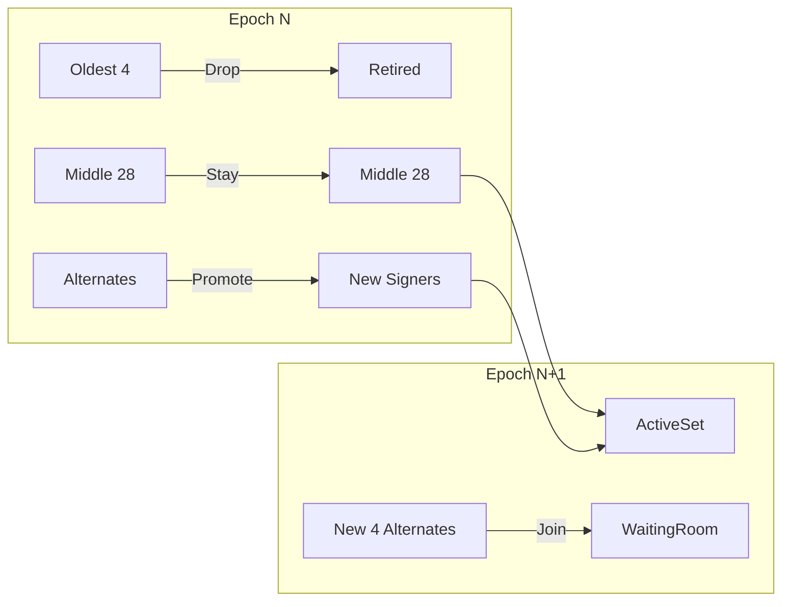
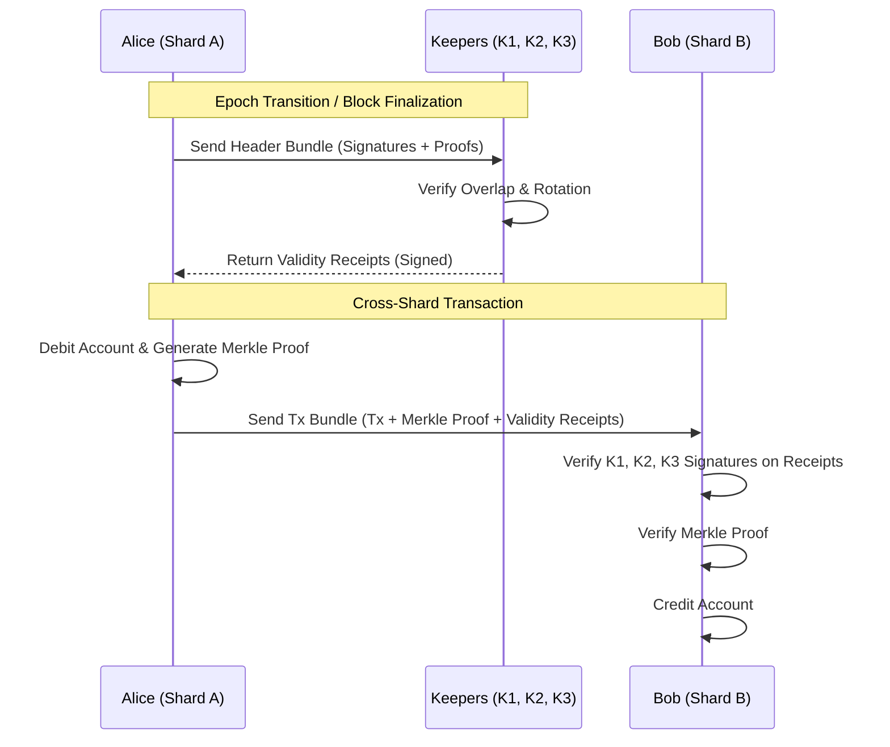
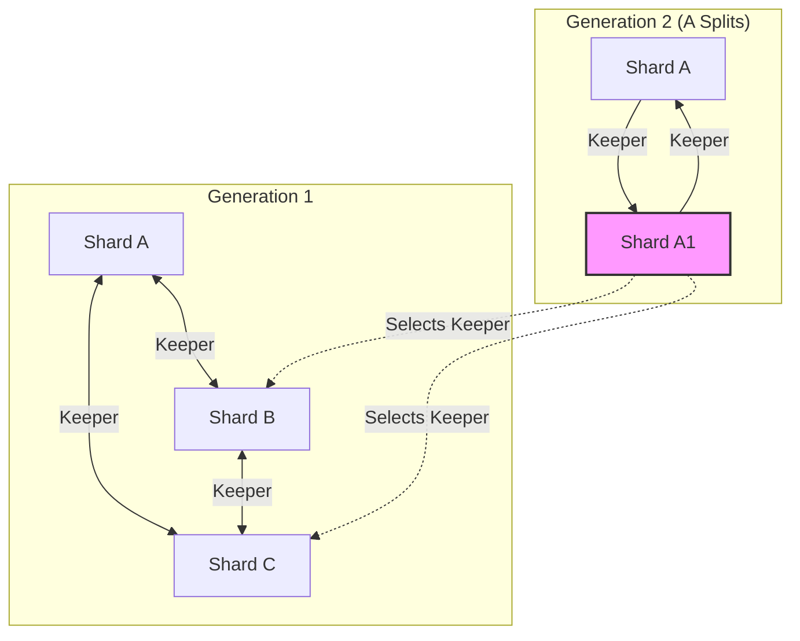

## YZ.social Braided Blockchain Architecture

## 1. Overview

The **Braided Blockchain** is a massively scalable, sharded distributed ledger system that eschews global consensus in favor of a **mesh of mutually validating shards**. It achieves security and validity through a novel "Keeper" system, creating a braided web of trust where shards act as notaries for one another.

### Key Philosophy
- **No Global Finality:** Truth is local to a shard, but provably consistent across the network.
- **Homogeneous Execution:** All shards speak the same protocol and use the same native token.
- **Braided Security:** Shards rely on a set of peer "Keeper Shards" to validate their history and evolution, rather than a central Beacon Chain.

---

## 2. Core Components

### 2.1. The Shard (Croquet Session)
Each shard is a **Croquet Consensus Session** responsible for a subset of accounts.
- **Participants:** 32 Active Validators + 4 Alternates.
- **Selection:** Randomly selected from the DHT node space.
- **Role:** Executes transactions, maintains local state, and produces blocks.

### 2.2. The Keeper Shards (The Notaries)
Every shard (Subject Shard) is monitored by **$M$ Keeper Keepers** (initially $M=3$).
- **Role:** Validates the **lineage** and **legitimacy** of the Subject Shard.
- **Responsibility:** Stores the header history of the Subject Shard and issues **Validity Receipts**.
- **Independence:** Keepers do not execute the Subject Shard's transactions; they only audit its validator set transitions.

### 2.3. The DHT Layer
- **Network Backbone:** Kademlia-like Distributed Hash Table.
- **Function:**
    - **Discovery:** Peer finding and routing.
    - **Pub/Sub:** Cross-shard communication channel.
    - **Randomness Source:** The DHT address space provides the entropy pool for selecting new participants.

---

## 3. The Consensus Mechanism: "Sliding Window"

Security within a shard is maintained by a slowly rotating set of validators. This prevents sudden hostile takeovers.

### 3.1. Validator Rotation
*   **Epoch Length:** Defined period (e.g., 10 minutes or 100 blocks).
*   **The Set:** 32 Active Signers + 4 Passive Alternates.
*   **The Transition (End of Epoch N):**
    1.  **Retirement:** The 4 "oldest" validators are removed from the active set.
    2.  **Promotion:** The 4 Alternates from Epoch N become Active Signers for Epoch N+1.
    3.  **Recruitment:** 4 *new* Alternates are selected from the DHT.
        *   **Selection Seed:** `Hash(Epoch_N_Signature)` (Unpredictable).
        *   **Selection Rule:** The 4 nodes in the DHT closest to the Seed.

### 3.2. The Overlap Proof
For a transition to be valid, the new validator set must be "endorsed" by the old one.
*   **Requirement:** At least **28** of the current signers must have been present in the previous epoch's validator set.
*   **Significance:** This ensures continuity. A completely new group cannot just show up and claim to be "Shard A".

---

## 4. Cross-Shard Validation: The "Keeper" Protocol

How does Shard B know Shard A is real? It relies on Shard A's **Keepers**.

### 4.1. The Keeper Contract
Shard A reports to Keepers $K_1, K_2, K_3$.
At the end of every epoch, Shard A sends a **Header Bundle** to all its Keepers.

**Header Bundle Content:**
1.  `Epoch_ID`: Current Epoch Number.
2.  `Previous_Hash`: Hash of the previous block.
3.  `Signatures`: Signatures from the 32 current validators.
4.  `Validator_List`: The list of public keys for this epoch.

### 4.2. Keeper Validation Logic (Executed by $K_1$)
When $K_1$ receives the bundle from A:
1.  **Fetch State:** $K_1$ retrieves the *previous* header it stored for A.
2.  **Verify Overlap:** Checks that the signers in the new bundle overlap with the previous validator set (The "28/32 Rule").
3.  **Verify Rotation:** Checks that the new validator set was formed correctly (Oldest 4 dropped, Alternates promoted).
4.  **Issue Receipt:** If valid, $K_1$ signs a **Validity Receipt**.

> **Validity Receipt:** "I, Shard $K_1$, certify that Shard A's transition to Epoch 101 is valid."

### 4.3. The Transaction Flow (Alice -> Bob)
Alice (Shard A) sends tokens to Bob (Shard B).

1.  **Execution:** Shard A debits Alice. Block is finalized.
2.  **Certification:** Shard A obtains Validity Receipts from its Keepers ($K_1, K_2, K_3$).
3.  **Transmission:** Shard A sends a message to Shard B via DHT Pub/Sub.
    *   **Payload:**
        *   Transaction Data ("Alice -> Bob: 10 Coins")
        *   Merkle Proof (Tx inclusion in Shard A's block)
        *   **Validity Proof:** The Validity Receipts from $K_1, K_2, K_3$.
4.  **Verification (Shard B):**
    *   Shard B checks the Receipts.
    *   "Do I trust $K_1$?" -> Yes, $K_1$ is a known valid shard (checked recursively or via cached reputation).
    *   "Did $K_1$ sign this receipt?" -> Yes.
    *   **Result:** Shard B accepts the funds and credits Bob.

---

## 5. Braided Evolution: Split & Growth

The network starts small and grows organically, maintaining the "Braid".

### 5.1. Genesis
*   **Shards:** A, B, C, D.
*   **Keeper Mapping:**
    *   A is kept by {B, C, D}
    *   B is kept by {A, C, D}
    *   (Full mesh)

### 5.2. Shard Splitting (Cell Division)
When Shard A becomes overloaded:
1.  **Trigger:** Shard A reaches a state size / transaction volume threshold.
2.  **Split:** Shard A divides its address space.
    *   **Shard A (Parent/Original):** Keeps lower half of accounts.
    *   **Shard A1 (Child/New):** Takes upper half of accounts.
3.  **Keeper Assignment for A1:**
    *   **Inherited:** A1 uses **Shard A** as its primary Keeper (Parental Supervision).
    *   **Selected:** A1 selects 2 additional Keepers from A's existing connections or their descendants (e.g., B1, C2) at random.
4.  **Stability:** Shard A1 now has 3 Keepers. It never needs to change them unless a Keeper dies.

### 5.3. The Resulting Topology
This creates a **DAG (Directed Acyclic Graph) of Trust**.
*   Every shard is anchored to the graph by 3 threads.
*   Validating a shard is a matter of traversing these threads a short distance to finding a common trusted ancestor or a widely recognized node.

---

## 6. Validity & Security Proofs

### Why is this secure?

1.  **Sybil Resistance:**
    *   Validators are chosen randomly from the DHT.
    *   A Sybil attacker cannot force their nodes to be selected for a specific shard without controlling a vast portion of the global DHT.

2.  **Takeover Resistance (Sliding Window):**
    *   An attacker can only introduce 4 new nodes per epoch.
    *   To control the shard (2/3 majority), they would need to win the "random alternate lottery" for 6 consecutive epochs without detection.

3.  **Fake Shard Resistance (Keeper Braid):**
    *   A fake shard cannot generate a valid chain of **Validity Receipts** because it cannot prove the "Overlap" with a history known to the Keepers.
    *   To fake a receipt, the attacker would need to compromise the **Keeper Shards** as well. Since Keepers are random (A doesn't choose B, they were assigned at genesis/split), collusion is difficult.

4.  **Auditability:**
    *   The entire history of Shard A's validator sets is mirrored on Shards B, C, and D. If Shard A vanishes or turns malicious, the Keepers hold the "forensic evidence" of who was in charge.

## 7. Implementation Roadmap

1.  **Phase 1: The Nucleus**
    *   Implement the **Croquet Session Wrapper** (The Shard).
    *   Implement **DHT Node** with random participant selection.
    *   Launch Genesis Cluster (A, B, C, D) running locally.

2.  **Phase 2: The Keeper Protocol**
    *   Implement **Header Bundling** and **Receipt Signing**.
    *   Implement the **Overlap Verification Logic**.
    *   Demonstrate Shard A proving validity to Shard B via Shard C's receipt.

3.  **Phase 3: The Split**
    *   Implement **State Migration** (A -> A + A1).
    *   Implement **Keeper Discovery** for new shards.

4.  **Phase 4: Scale Test**
    *   Simulate 100 shards.
    *   Test "Six Degrees of Separation" verification performance.

